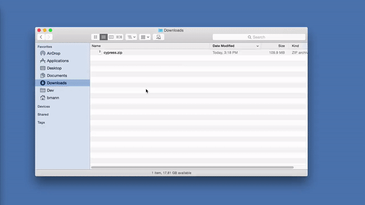

## About
Presentation about integration tests with <a href="https://www.cypress.io/">Cypress</a> given to the <a href="https://compassouol.com/">Compasso UOL</a> company.

### :rocket: Technologies

This project uses these technologies:
- [React](https://reactjs.org/)
- [Cypress](https://www.cypress.io/)
- [Mirage](https://miragejs.com/)
- [Styled Components](https://styled-components.com/)

### :computer: Dependencies
#### Start React Project
``` npm
npx create-react-app cypress-course
```
#### Install Cypress
``` npm 
npm install cypress
```
<div align="center">
   
</div>

##### Finish Installing Cypress
You can follow the step by step through this 
<a href="https://docs.cypress.io/guides/getting-started/installing-cypress.html#yarn-add">tutorial</a>

#### Install Mirage
``` npm 
npm install --save-dev miragejs
```

We can find a Mirage JS tutorial <a href="https://www.youtube.com/watch?v=3taVrGZVCr8&ab_channel=SamSelikoff">here</a>.

### :zap: Commands

#### Run the project
``` npm 
npm start
```
Open <a href="http://localhost:3000/">http://localhost:3000/</a>

##### Run Cypress

``` npx 
npx cypress open
```
